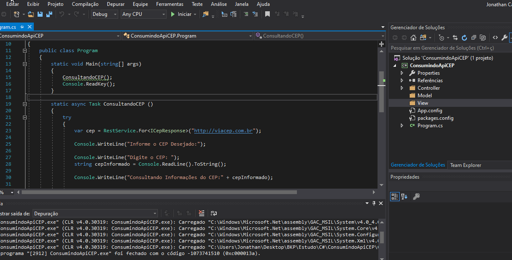

# Api CEP Correios 💻

## 📝 Description 

Este projeto consiste no desenvolvimento de um pequeno serviço de consumo de uma api de CEP (Correios) em C# .NET

 
# Frameworks

Utilizei alguns framework´s para facilitar o desenvolvimento.

 • Newtonsoft.Json.  
 • Refit (Rest).  
 • .NETFramework 4.1. 
 

# Execute

  
## 🚀 Technologies Used 

# Visual Studio 2017 - Community 
 

   

## 🔓 License 
MIT ©  Jonathan

